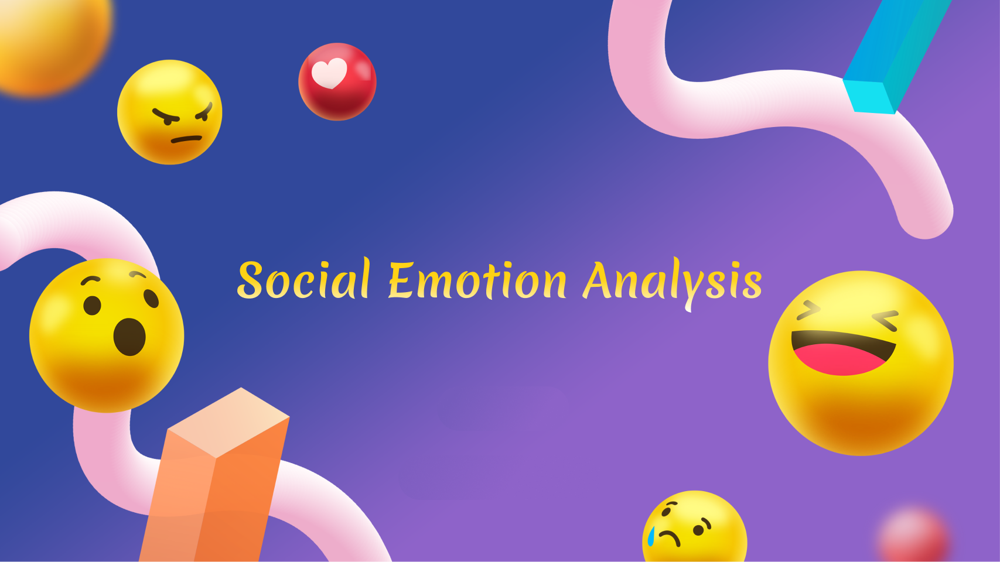

 

 
 
 
 
 

 

# Social Emotion Analysis | SEA

A tool for detecting social emotions in Text.

# Getting Started
Visit the tool on [Social Emotion Analysis](https://social-emotion-analysis.streamlit.app/)

# Contributing

We are open to all contributions. If you want to contribute to this project, open a pull request or create an issue and we will get back to you as soon as possible.

# License

MIT License